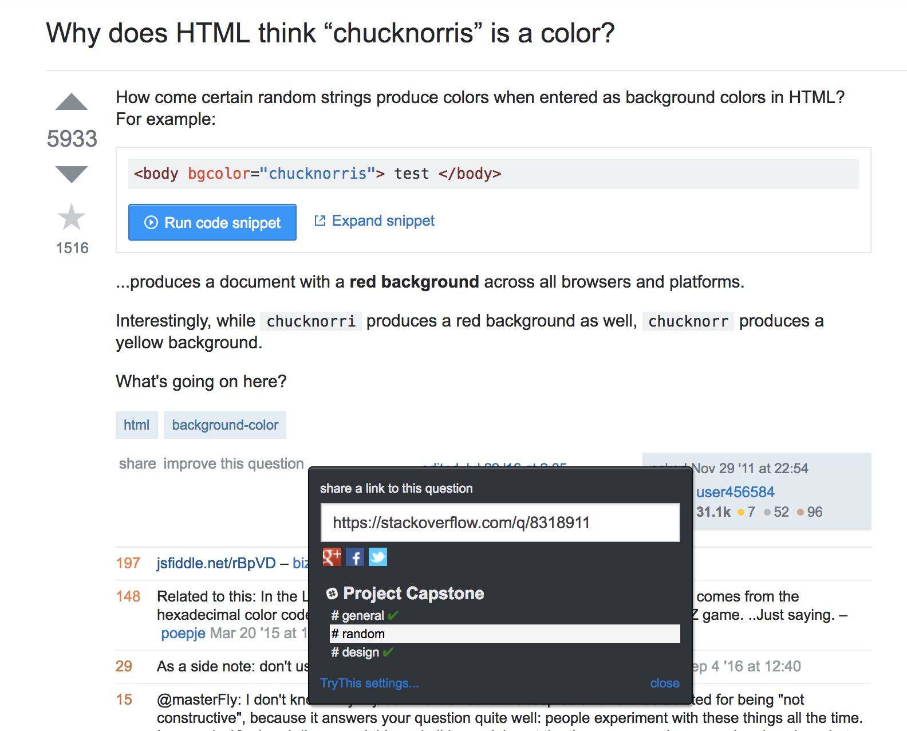
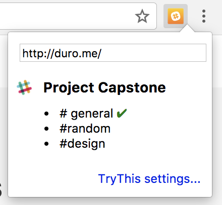
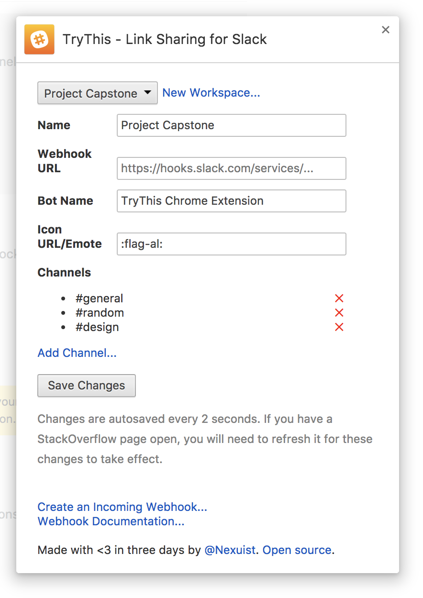

### Introduction

TryThis is a Chrome extension that allows you to share a link to your current page in any Slack channel you're in through the use of webhooks.

TryThis even integrates directly into StackOverflow's share button, so you don't even have to move your cursor that far:



And for any other cool sites you find, TryThis is available directly from the toolbar:



 With TryThis, you can customize the name of your webhook, give it an emote or profile picture URL, manage visible channels, and click once to share a link, all within a few clicks and all without ever having to log in to Slack.

 

### Technologies

TryThis uses [Vue.js](https://vuejs.org) for the popup and settings pages, and of course the [Chrome APIs](https://developer.chrome.com/extensions/api_index) for everything else.

>**NOTE:** If you wish to compile TryThis yourself, you will need to save the production version of Vue.js as `vue.prod.js` in the `src/` folder in order for everything to work correctly. TryThis was built with Vue.js v2.5.1.

### License

```MIT License

Copyright (c) 2017 Andi Andreas

Permission is hereby granted, free of charge, to any person obtaining a copy
of this software and associated documentation files (the "Software"), to deal
in the Software without restriction, including without limitation the rights
to use, copy, modify, merge, publish, distribute, sublicense, and/or sell
copies of the Software, and to permit persons to whom the Software is
furnished to do so, subject to the following conditions:

The above copyright notice and this permission notice shall be included in all
copies or substantial portions of the Software.

THE SOFTWARE IS PROVIDED "AS IS", WITHOUT WARRANTY OF ANY KIND, EXPRESS OR
IMPLIED, INCLUDING BUT NOT LIMITED TO THE WARRANTIES OF MERCHANTABILITY,
FITNESS FOR A PARTICULAR PURPOSE AND NONINFRINGEMENT. IN NO EVENT SHALL THE
AUTHORS OR COPYRIGHT HOLDERS BE LIABLE FOR ANY CLAIM, DAMAGES OR OTHER
LIABILITY, WHETHER IN AN ACTION OF CONTRACT, TORT OR OTHERWISE, ARISING FROM,
OUT OF OR IN CONNECTION WITH THE SOFTWARE OR THE USE OR OTHER DEALINGS IN THE
SOFTWARE.```